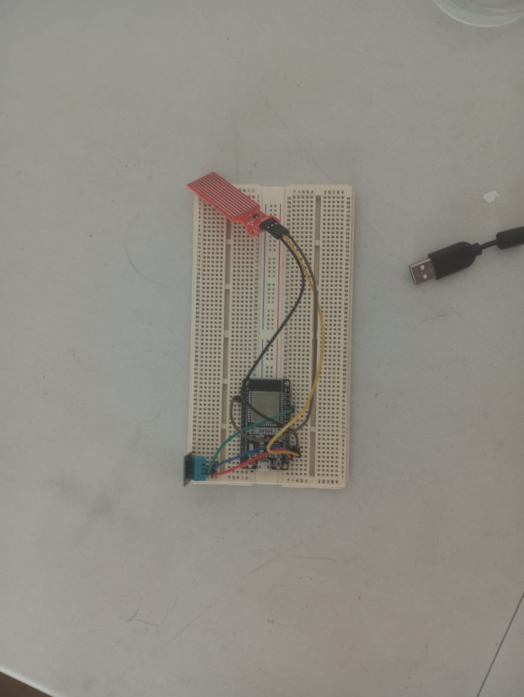

# **TerraBoard v0.1 – Documentación completa del proyecto**

## **¿Qué es TerraBoard?**

TerraBoard es un **sistema de monitoreo en tiempo real de terrarios** para mascotas exóticas (tarántulas, jerbos, dragones barbudos para fines de prueba). Permite:

- Ver temperatura, humedad y nivel de agua en tiempo real  
- Consultar gráficas diarias con umbrales personalizados por especie
- Revisar datos históricos (última medición)
- Aprender sobre los cuidados generales de cada mascota
- Recibir datos desde un `ESP32` con sensores de nivel de agua, temperatura y humedad.

---

## Arquitectura del sistema
Un circuito compuesto por un microprocesador `ESP32-WROOM`, un sensor de temperatura y humedad relativa `DHT11`, y un sensor de nivel de agua `HW-038`. Complementado con un Dashboard que permite distintos tipos de visualización de cada variable.

### Su funcionamiento está definido por el siguiente esquema:
- **`MySQL`, Base de datos 'iot_ESP32'**:
  Sus tablas permiten el acceso a los rangos de las condiciones ideales (temperatura y humedad máximas y mínimas) de cada animal, las últimas mediciones de circuito y finalmente al promedio de las mediciones tomadas durante el último minuto, a través de un evento definido para llevarse a cabo cada minuto.<br><br>

- **Servidor `Flask` y túnel `ngrok`**:
  Desde `Flask` se pone a disposición, a través del localhost, escuchando en el puerto 5000, un `API REST` (Application Programming Interace Representational Estate of Transfer) que maneja las peticiones `HTTP`.<br>
  Solamente `Flask` ya permite la comunicación entre las peticiones del circuito y la base de datos, sin embargo se utiliza el tunel de `ngrok` que expone nuestro puerto para que sea accesible desde la web, con la encriptación que `ngrok` confiere entre las comunicaciones (ahora `HTTPS`, no `HTTP`);<br>
  El uso de `ngrok` nos permitió enviar peticiones desde fuera de la red local, sin embargo, por utilizar su plan gratuito, limitó la cantidad de endpoints disponibles a tres y eso tuvo un impacto directo en la manera en que se modelaron los endpoints.<br><br>

- **`ESP32`**:
  En primera instancia importa las librerías e inicializa los pines correspondientes a cada componente del circuito, así como las variables necesarias para el resto del programa.<br>
  Las principales rutinas del programa se encargan de calibrar el sensor de nivel de manera guiada (se lleva a cabo durante el `setup`) y de enviar los datos al servidor (durante el loop).<br>
  Sin embargo, también fueron programadas (durante el `setup`) las inicializaciones de sensores, monitor serial (`canal 115200`), pines de LEDs, conexión a WiFi; y también (durante el `loop`) el manejo del tiempo entre cada envío de datos al servidor y la lógica de encendido de LEDs, para indicar el estado de la temperatura.<br><br>

- **Interfaces de visualización**:
  El circuito, compuesto por el `ESP32`, el `DHT11` y el sensor de nivel de agua, está designado por el programa, que se carga desde el IDE Arduino, para realizar un envío de lo medido de cada sensor a través del protocolo `HTTP` (Hyper Text Transfer Protocol) mediante una request de tipo `POST`, con una URL codificada con los pares clave valor de c/variable, concatenados dichos pares con ampersands.


### Componentes principales

| Parte | Tecnología | Función principal |
|-|-|-|
| Hardware | `ESP32`, `DHT11`, `HW-038` | Lectura de sensores |
| Backend | `Flask` y `MySQL` | `API REST` y generación de gráficas |
| Base de datos | `MySQL` (iot_ESP32) | Almacenamiento y promedios por minuto |
| Frontend | HTML, CSS, JS | Dashboard web |
| Túnel seguro | `ngrok` | Exponer servidor local a internet |

---

## Estructura de la base de datos `iot_ESP32`

`registro_ambiente`: Registros crudos cada ~6 segundos
`promedios_por_minuto`: Promedio de cada minuto (calculado por EVENT)
`rangos_animales`: Rangos ideales por especie


### La tabla clave: `rangos_animales`

| Nombre | minTemp | maxTemp | minHum | maxHum |
|-|-|-|-|-|
| Tarántula | 22.00 | 30.00 | 60.00  | 70.00 |
| Jerbo | 20.00 | 22.00 | 30.00 | 50.00 |
| Dragón Barbudo | 22.00 | 40.00 | 30.00 | 40.00 |

---

## Endpoints de la API `Flask`

| Ruta | Método | Parámetros | Respuesta principal |
|-|-|-|-|
| `/datos` | `POST` | `temp`, `hum`, `nivel_agua`, `estabilidad` | Guarda datos del `ESP32` |
| `/datos` | GET | — | Mensaje de bienvenida |
| `/dashboard` | GET | `?animal=Nombre` | JSON con valores actuales, gráfica diaria en base64 |
| `/promedios_por_minuto` | GET | — | Último minuto con promedio (para Historia.html) |

---

## Funcionalidades del Frontend
- Persistencia con `localStorage` del animal seleccionado

### 1. **Dashboard.html**
- Muestra temperatura, humedad y nivel de agua en tiempo real
- Botón "Actualizar" llama a `/dashboard`
- Gráfica generada con Matplotlib (PNG, base64)
- Líneas de umbrales **según la mascota** seleccionada
- Indicador de estabilidad en la temperatura (Estable/No estable)

### 2. **Historia.html**
- Muestra el último promedio por minuto (el más reciente)
- Fácil de expandir a tabla histórica completa

### 3. **AprendeDeTuMascota.html**
- Información general **consecuente con la selección de animal**
- Fondo e imagen dinámica **según la mascota**
- Condiciones ideales destacadas

---

## Código `ESP32` – Resumen de funcionamiento

Sensores:
- `DHT11`: Temperatura ***(+-2°C de margen de error)*** y humedad ***(+-5% de margen de error)***
- Sensor analógico `HW-038`: Nivel de agua (calibración manual en setup). **IMPORTANTE CARACTERIZARLO, TODA VEZ QUE ES UN SENSOR CASERO Y MUY PROPENSO A CAMBIAR.**

Envío:
- Cada 6 segundos **(condicionado por la estabilidad del DHT11)**, `POST` a /datos
- Incluye campo "estabilidad" (según variación de temperatura)

LEDs de estado (fueron retirados los LEDs de nuestro circuito pero pueden ser añadidos y funcionar, ya están contempladas las configuraciones de sus pines dentro del código):
- Verde: temperatura en rango
- Rojo: fuera de rango
- Amarillo parpadeante: estado transición

Calibración del sensor de agua:
- Interactiva por puerto serie al iniciar
- 3 niveles (bajo, medio, alto), valores 0%, 50%, 100%

---

## Configuración y puesta en marcha
Se recomienda utilizar un virtual environment para probar este proyecto.

Este proyecto sólo se ha probado bajo las siguientes condiciones:
```
- S.O Linux Debian 13
- MySQL 8.0.44-1 for Linux on x86_64 ((Debian))
- Python 3.13.9, con las librerías especificadas en el requirements.txt
- ngrok version 3.33.1
- Sensores:
  - ESP-WROOM-32, con WiFi
  - DHT11
  - HW-038
- Arduino IDE 2.3.6
  - Adafruit Unified Sensor v1.1.15
  - Adafruit's DHT Sensor Library v.1.4.6
- Google Chrome 141.0.7390.107 
```

### Alistando el entorno:
1. Descarga el repositorio en tu computadora y accede al directorio del mismo.
2. Asegúrate de tener instalados y configuradas las versiones especificadas de python, MySQL, ngrok, IDE Arduino, librerías de Adafruit y una versión reciente de Google Chrome.
3. Crea un virtual environment para instalar las librerías de python necesarias (bajo `requirements.txt`)
4. Monta un circuito como el de la imagen 
  - `DHT11` (positivo: `3v3`, tierra: `GND`, señal: `GPIO 21`)
  - `HW-038` (positivo: `3v3`, tierra: `GND`, señal: `GPIO 34` por ser analógico)

  **CONSIDERA QUE ESTAS CONFIGURACIONES FUERON IDEADAS PARA EL MODELO ESPECIFICADO DE `ESP32`, PUEDES CONSULTAR UN DATASHEET Y MODIFICAR LOS PINES EN EL CÓDIGO `Envia_BD_ESP32.ino` SI NECESITAS CAMBIOS.**  

### Puesta en marcha del servidor:
1. Una vez que tengas instalado `ngrok`, ejecuta `ngrok http 5000` para exponer tu puerto 5000 y que se te asigne bajo "Forwarding" una URL tunel hacia tu servidor. Copia dicha URL.
2. Detén la ejecución de `ngrok` (sólo queríamos conocer la URL).
3. Añadir la URL asignada por `ngrok` a los siguientes archivos (busca dentro de cada archivo, con un editor de texto, el término "TU_PROPIA_URL" y sustitúyelo sin modificar el endpoint): `Dashboard.html`, `Historia.html`, `Envia_BD_ESP32.ino`.
4. En el archivo `Envia_BD_ESP32.ino`, justo encima de la línea en la que ingresaste tu URL, se encuentran los campos de SSID y contraseña de red WiFI. Ingresa los tuyos.
5. Añadir tu usuario y contraseña de MySQL en el archivo `server.py`, que por defecto expone el puerto 5000. **ASEGÚRATE DE QUE ESTÉ DISPONIBLE O SUSTITUYE POR UN PUERTO QUE SÍ LO ESTÉ**.
6. Guarda los cambios en todos los archivos.
7. Abrir el IDE `Arduino 2.3.6`, conectar el circuito y seleccionar la tarjeta y puerto correspondientes.
8. Seleccionar el canal de comunicación `115200` para el Serial Monitor.
9. Cargar el código al circuito y comenzar con la calibración guiada del sensor de nivel.
10. Ahora mismo el `ESP32` intenta enviar datos al servidor pero aún no está en escucha. Abre una terminal y dirígete a la carpeta del repositorio.
11. Abre una terminal y sitúala en el directorio del proyecto, entonces ejecuta el siguiente comando `mysql -u TU_USUARIO_DE_MYSQL -p < ./crear.sql`. Esto creará la base de datos con las tablas y eventos requeridos.
12. Acto seguido, **EN UNA NUEVA VENTANA DE LA CONSOLA**, activa el entorno virtual que acabas de crear y ejecuta `python server.py` o `python3 server.py` (depende de tu S.O). Ahora el servidor local está funcionando.
13. Ahora, **EN OTRA NUEVA VENTANA DE LA CONSOLA**, ejecuta `ngrok http 5000`, esto expondrá tu servidor y hará posible la conexión entre la base de datos, el circuito y el dashboard.
14. A continuación, abre `./Dashboard/Dashboard.html` en tu navegador (preferiblemente Google Chrome). NO TE QUEDES AHÍ, SÓLO ÁBRELO Y VUELVE A LA CONSOLA.
15. Finalmente activa el evento que calcula los promedios por minuto (Ya estaba declarado y existía, pero estaba desactivado): ejecuta `mysql -u TU_USUARIO_DE_MYSQL -p < ./activar.sql`
16. IMPORTANTE: No esperes registro en el apartado de Historia ni visualización alguna si no ha transcurrido al menos un minuto. Dichas características del proyecto dependen de registros en `promedios_por_minuto`, y esta tabla sólo comenzará a llenarse al haber transcurrido al menos un minuto desde que activas el evento del paso 15.
17. Si deseas reiniciar la prueba con una base de datos limpia, puedes ejecutar `mysql -u TU_USUARIO_DE_MYSQL -p < ./borrar.sql`
